# Toko Bunga Melati - Sistem Reservasi dan Manajemen Toko Bunga

Aplikasi ini merupakan tugas Ujian Akhir Semester mata kuliah Pemrograman Web Lanjut. Aplikasi berfungsi sebagai sistem manajemen toko bunga yang mencakup katalog produk, pemesanan, reservasi acara (pernikahan, ulang tahun, dan acara lainnya), autentikasi pengguna dengan verifikasi email, pembagian peran Admin dan User, dashboard statistik, ekspor laporan dalam format PDF, serta REST API.

## Identitas

Nama: Luthan Asthalariq

NIM: 240170208

Kelas: Pemrograman Web Lanjutan A7

## Fitur

1. Login dan registrasi pengguna dengan verifikasi email (Laravel Breeze)
2. Operasi CRUD lengkap untuk Kategori, Produk, dan pengelolaan status Pesanan
3. Pembagian peran Admin dan User dengan hak akses yang berbeda
4. Tampilan responsif menggunakan Tailwind CSS
5. Dashboard admin yang menampilkan statistik produk, pesanan, pendapatan, dan produk terlaris
6. Ekspor laporan pesanan ke dalam format PDF
7. REST API untuk produk, kategori, pesanan, dan login dengan autentikasi token (Laravel Sanctum), yang siap diuji menggunakan Postman

## Teknologi yang Digunakan

1. Laravel 11 (PHP)
2. Laravel Breeze untuk autentikasi dan verifikasi email
3. Laravel Sanctum untuk autentikasi token pada REST API
4. MySQL sebagai basis data
5. Tailwind CSS (melalui CDN)
6. Pustaka barryvdh/laravel-dompdf untuk ekspor PDF

## Cara Instalasi dan Menjalankan Aplikasi

### Langkah 1: Clone Repository

```bash
git clone <link-repo-github-anda>
cd toko-bunga-melati
```

### Langkah 2: Instalasi Dependensi PHP dan JavaScript

```bash
composer install
npm install
```

### Langkah 3: Konfigurasi Environment

```bash
cp .env.example .env
php artisan key:generate
```

### Langkah 4: Migrasi Database dan Storage Link

```bash
php artisan migrate
php artisan db:seed
php artisan storage:link
```

### Langkah 5: Build Asset Frontend

```bash
npm run build
```

### Langkah 6: Menjalankan Aplikasi

```bash
php artisan serve
```

Aplikasi dapat diakses melalui alamat http://localhost:8000

## Akun Demo

| Peran | Email | Kata Sandi |
|---|---|---|
| Admin | admin@tokobungamelati.test | password |
| User | user@tokobungamelati.test | password |

Akun demo di atas dibuat secara otomatis melalui perintah php artisan db:seed dengan status email yang telah terverifikasi.

## REST API dan Pengujian di Postman

Aplikasi ini menyediakan REST API sederhana dengan autentikasi token menggunakan Laravel Sanctum. Berkas koleksi Postman tersedia pada file postman_collection.json.

### Daftar Endpoint

| Method | Endpoint | Keterangan | Autentikasi |
|---|---|---|---|
| POST | /api/login | Login dan mengembalikan Bearer token | Tidak |
| GET | /api/user | Data pengguna yang sedang login | Ya |
| POST | /api/logout | Logout dan mencabut token | Ya |
| GET | /api/categories | Daftar kategori | Tidak |
| GET | /api/categories/{id} | Detail kategori | Tidak |
| POST | /api/categories | Menambah kategori | Ya (Admin) |
| PUT | /api/categories/{id} | Memperbarui kategori | Ya (Admin) |
| DELETE | /api/categories/{id} | Menghapus kategori | Ya (Admin) |
| GET | /api/products | Daftar produk, mendukung parameter search dan category_id | Tidak |
| GET | /api/products/{id} | Detail produk | Tidak |
| POST | /api/products | Menambah produk | Ya (Admin) |
| PUT | /api/products/{id} | Memperbarui produk | Ya (Admin) |
| DELETE | /api/products/{id} | Menghapus produk | Ya (Admin) |
| GET | /api/orders | Daftar pesanan milik sendiri, atau seluruh pesanan bagi admin | Ya |
| GET | /api/orders/{id} | Detail pesanan | Ya |
| POST | /api/orders | Membuat pesanan baru | Ya |

### Cara Pengujian di Postman

1. Import berkas postman_collection.json ke dalam aplikasi Postman.
2. Buka request Login, isi email dan kata sandi akun demo, klik tombol Send, kemudian salin nilai token dari response yang diterima.
3. Klik nama koleksi, buka tab Variables, tempelkan token pada variabel token, lalu simpan.
4. Seluruh request yang membutuhkan autentikasi login sudah dapat diuji.

Bukti pengujian ditampilkan pada bagian berikut.

Login dengan token yang dihasilkan:

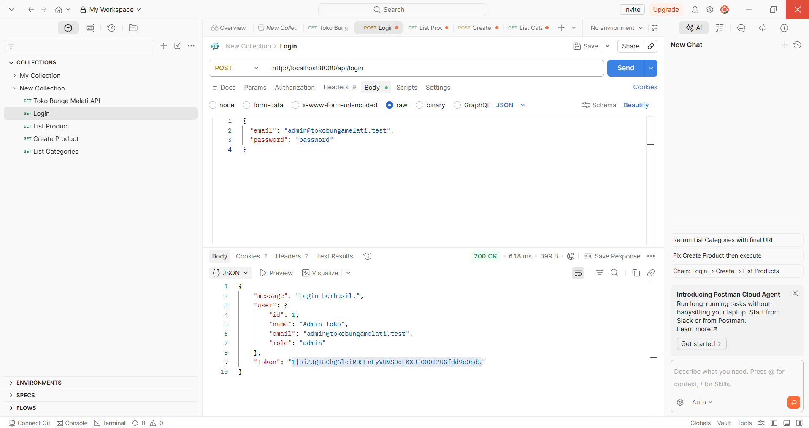

Pembuatan produk oleh admin:

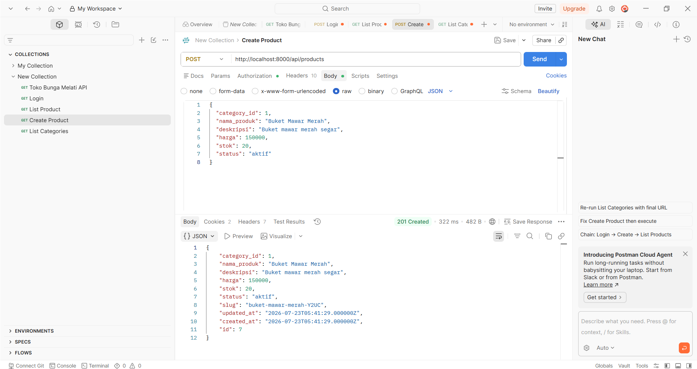

## Dokumentasi Antarmuka Aplikasi

### Login dan Registrasi

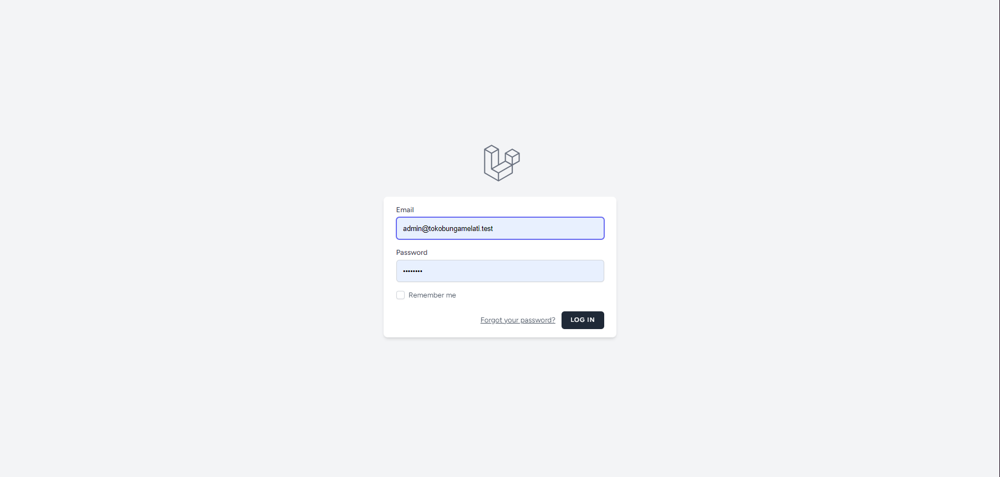
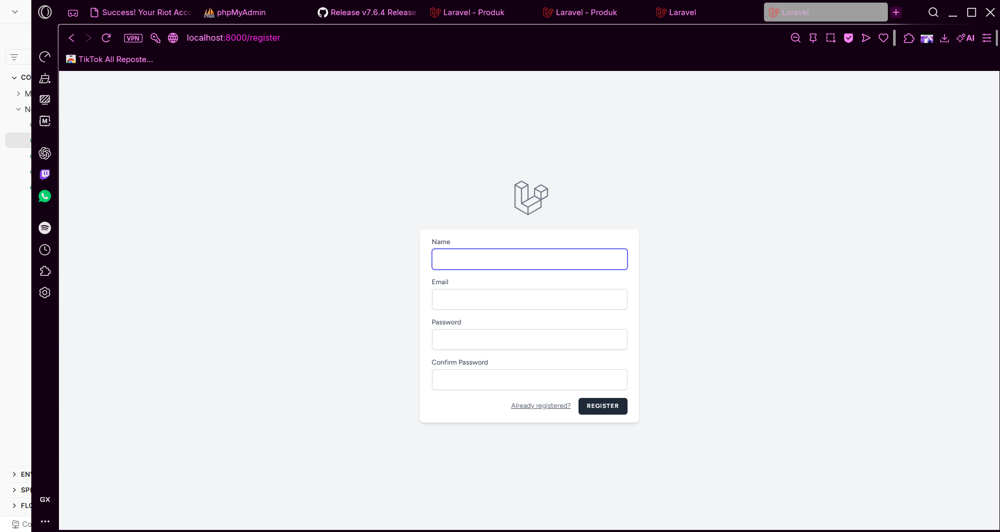

### Verifikasi Email

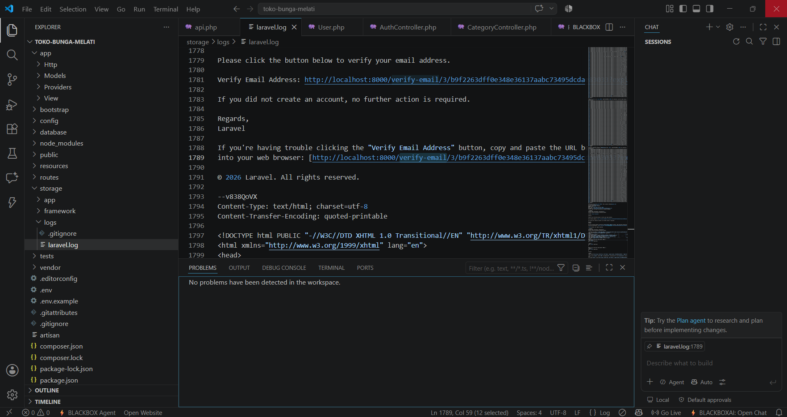

### Dashboard Admin


### Pengelolaan Kategori dan Produk

Halaman Kelola Kategori menampilkan daftar kategori beserta jumlah produk yang terkait pada masing-masing kategori, dilengkapi dengan fitur untuk menambah, memperbarui, dan menghapus data kategori.

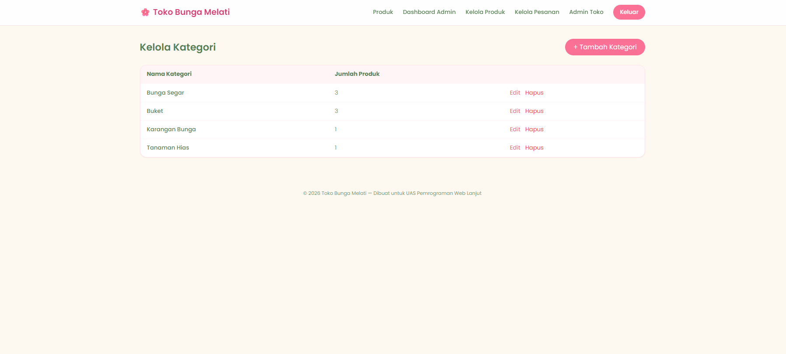

Halaman Kelola Produk menampilkan daftar produk secara lengkap beserta kategori, harga, jumlah stok, dan status, dilengkapi dengan fitur untuk menambah, memperbarui, dan menghapus data produk.

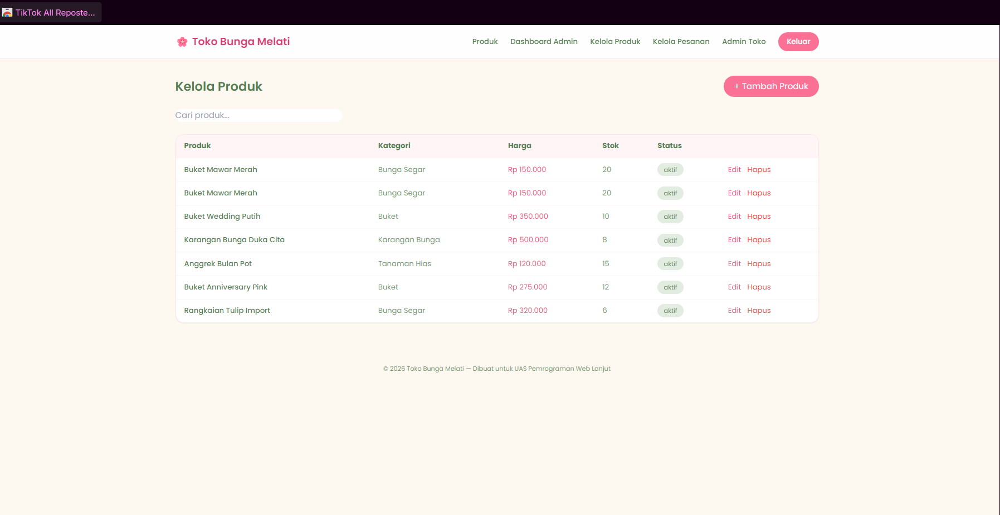

### Pengujian REST API di Postman

Dokumentasi pengujian REST API ditampilkan pada bagian REST API dan Pengujian di Postman sebelumnya.

### Perbedaan Menu pada Peran Admin dan User

Menu navigasi untuk peran Admin memiliki akses ke Dashboard Admin, Kelola Produk, Kelola Pesanan, dan Admin Toko, selain menu Produk yang bersifat umum.

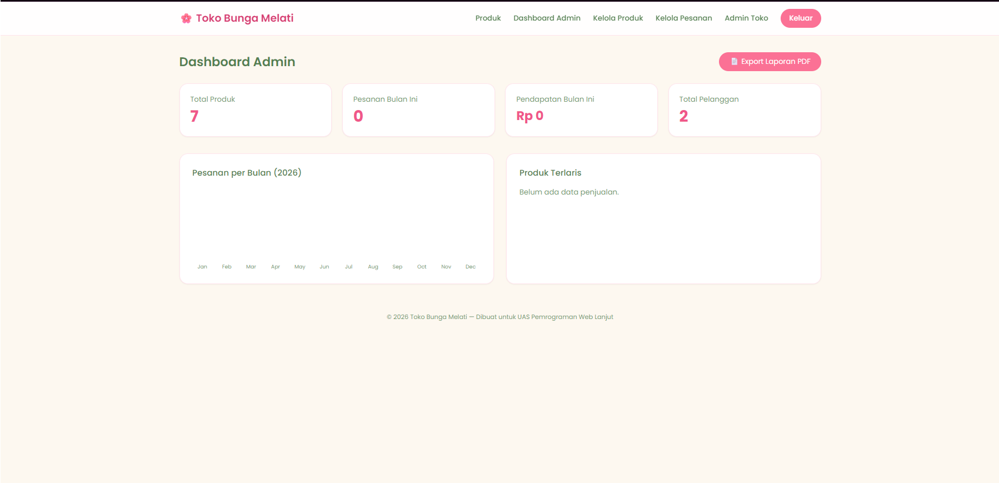

Menu navigasi untuk peran User hanya memiliki akses ke menu Produk, Pesanan Saya, dan Reservasi Saya.

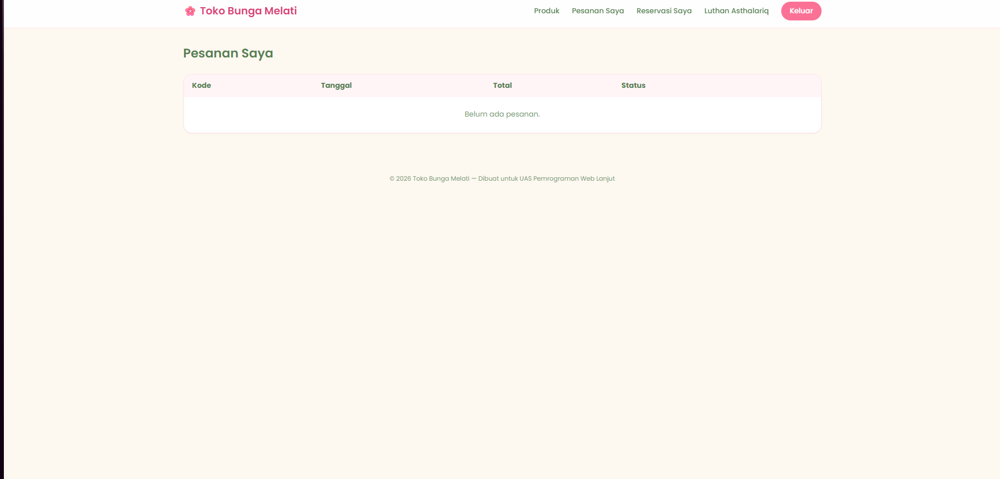

### Tampilan Responsif

Tampilan pada perangkat desktop:


Tampilan pada perangkat mobile:

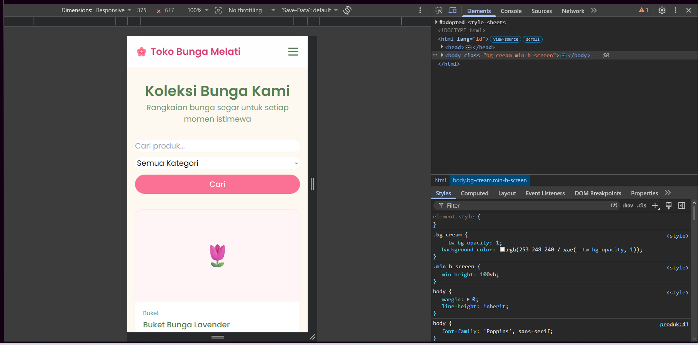

### Ekspor Laporan PDF

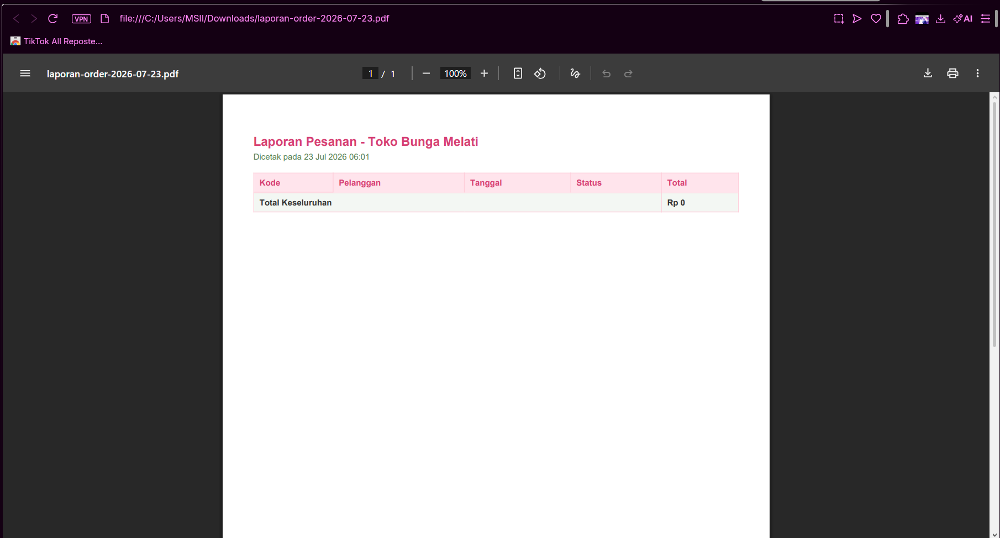

## Struktur Peran Pengguna

Peran Admin memiliki wewenang untuk mengelola kategori, mengelola produk, mengelola status pesanan, melihat dashboard, mengekspor laporan, serta memiliki akses penuh terhadap REST API.

Peran User memiliki wewenang untuk melihat katalog produk, memesan produk, mengajukan reservasi acara, melihat riwayat pesanan dan reservasi milik sendiri, serta memiliki akses terbatas terhadap REST API yang hanya mencakup data pesanan miliknya sendiri.

